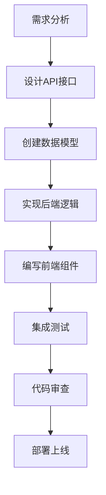

# 开发指南 - 就业找工作资讯门户网站

## 🏗️ 项目架构

### 整体架构
```
┌─────────────────┐    ┌─────────────────┐    ┌─────────────────┐
│   Frontend      │    │   Backend       │    │   Database      │
│   (React)       │◄──►│   (Node.js)     │◄──►│   (MongoDB)     │
│                 │    │                 │    │                 │
│ - UI Components │    │ - API Routes    │    │ - User Data     │
│ - State Mgmt    │    │ - Business Logic│    │ - Job Data      │
│ - Routing       │    │ - Auth System   │    │ - Company Data  │
└─────────────────┘    └─────────────────┘    └─────────────────┘
```

### 技术选型原因

| 技术 | 选择原因 |
|------|----------|
| React | 组件化开发，生态丰富，社区活跃 |
| TypeScript | 类型安全，提高代码质量 |
| Redux Toolkit | 简化状态管理，内置最佳实践 |
| Tailwind CSS | 实用优先，快速开发，一致性好 |
| Node.js | JavaScript全栈，性能好 |
| Express | 轻量级，中间件丰富 |
| MongoDB | 文档型数据库，灵活性强 |
| Socket.io | 实时通信，跨平台兼容 |

## 🎯 核心功能设计

### 1. 用户系统
```typescript
// 用户类型设计
interface User {
  id: string;
  email: string;
  userType: 'student' | 'professional' | 'hr';
  profile: UserProfile;
  membership: MembershipInfo;
}

// 认证流程
Login → JWT Token → Protected Routes → User Context
```

### 2. 企业招聘系统
```typescript
// 企业模型
interface Company {
  id: string;
  name: string;
  jobs: Job[];
  historicalData: HistoricalData[];
  rating: CompanyRating;
}

// 职位模型
interface Job {
  title: string;
  company: CompanyRef;
  requirements: string[];
  salary: SalaryRange;
  status: JobStatus;
}
```

### 3. 社区系统
```typescript
// 帖子模型
interface Post {
  id: string;
  author: UserRef;
  title: string;
  content: string;
  category: PostCategory;
  likes: number;
  comments: Comment[];
}
```

## 📁 代码组织结构

### 前端结构
```
client/src/
├── components/          # 可复用组件
│   ├── common/         # 通用组件
│   ├── forms/          # 表单组件
│   ├── layout/         # 布局组件
│   └── ui/             # UI组件
├── pages/              # 页面组件
│   ├── auth/           # 认证相关页面
│   ├── dashboard/      # 仪表板
│   └── public/         # 公共页面
├── hooks/              # 自定义Hooks
├── services/           # API服务
├── store/              # Redux状态管理
├── types/              # TypeScript类型
├── utils/              # 工具函数
└── assets/             # 静态资源
```

### 后端结构
```
server/src/
├── controllers/        # 控制器
├── middleware/         # 中间件
├── models/            # 数据模型
├── routes/            # 路由定义
├── services/          # 业务逻辑
├── utils/             # 工具函数
├── config/            # 配置文件
└── socket/            # Socket.io处理
```

## 🛠️ 开发工作流

### 1. 功能开发流程


### 2. 分支策略
```
main                    # 主分支，生产环境
  ├── develop          # 开发分支
  │   ├── feature/login    # 功能分支
  │   ├── feature/jobs     # 功能分支
  │   └── bugfix/auth      # 修复分支
  └── hotfix/security      # 紧急修复
```

### 3. 提交规范
```
feat: 新功能
fix: 修复bug
docs: 文档更新
style: 代码格式化
refactor: 重构代码
test: 测试相关
chore: 构建工具或辅助工具的变动

示例：
feat(auth): 添加用户登录功能
fix(jobs): 修复职位搜索Bug
docs(readme): 更新安装说明
```

## 🎨 UI/UX 设计规范

### 设计原则
1. **一致性** - 统一的设计语言
2. **可访问性** - 符合WCAG标准
3. **响应式** - 适配各种设备
4. **性能优先** - 快速加载体验

### 色彩系统
```css
/* 主要颜色 */
--primary-50: #eff6ff;
--primary-500: #3b82f6;
--primary-900: #1e3a8a;

/* 语义颜色 */
--success: #22c55e;
--warning: #f59e0b;
--error: #ef4444;
--info: #3b82f6;
```

### 组件规范
```typescript
// 按钮组件示例
interface ButtonProps {
  variant: 'primary' | 'secondary' | 'outline';
  size: 'sm' | 'md' | 'lg';
  loading?: boolean;
  disabled?: boolean;
  onClick?: () => void;
}
```

## 📊 数据库设计

### 数据模型关系
```
User (1:N) Posts
User (1:N) Applications
User (1:N) Messages
Company (1:N) Jobs
Job (1:N) Applications
Post (1:N) Comments
```

### 索引策略
```javascript
// 用户索引
db.users.createIndex({ email: 1 }, { unique: true });
db.users.createIndex({ username: 1 }, { unique: true });

// 职位索引
db.jobs.createIndex({ title: "text", description: "text" });
db.jobs.createIndex({ company: 1, status: 1 });
db.jobs.createIndex({ createdAt: -1 });

// 企业索引
db.companies.createIndex({ name: 1 }, { unique: true });
db.companies.createIndex({ industry: 1 });
```

## 🔐 安全最佳实践

### 认证安全
```typescript
// JWT配置
const jwtConfig = {
  secret: process.env.JWT_SECRET,
  expiresIn: '7d',
  algorithm: 'HS256'
};

// 密码加密
const hashPassword = async (password: string) => {
  const saltRounds = 12;
  return await bcrypt.hash(password, saltRounds);
};
```

### 数据验证
```typescript
// 输入验证中间件
const validateInput = (schema: Schema) => {
  return (req: Request, res: Response, next: NextFunction) => {
    const { error } = schema.validate(req.body);
    if (error) {
      return res.status(400).json({
        success: false,
        message: error.details[0].message
      });
    }
    next();
  };
};
```

### 安全headers
```typescript
// Helmet配置
app.use(helmet({
  contentSecurityPolicy: {
    directives: {
      defaultSrc: ["'self'"],
      styleSrc: ["'self'", "'unsafe-inline'"],
      scriptSrc: ["'self'"],
      imgSrc: ["'self'", "data:", "https:"],
    },
  },
  hsts: {
    maxAge: 31536000,
    includeSubDomains: true,
    preload: true
  }
}));
```

## 🚀 性能优化

### 前端优化
```typescript
// 代码分割
const JobsPage = lazy(() => import('./pages/Jobs'));
const CompaniesPage = lazy(() => import('./pages/Companies'));

// 虚拟滚动
import { FixedSizeList as List } from 'react-window';

// 图片懒加载
const LazyImage = ({ src, alt }) => {
  const [isLoaded, setIsLoaded] = useState(false);
  const [isInView, setIsInView] = useState(false);
  
  // Intersection Observer实现
};
```

### 后端优化
```typescript
// 数据库查询优化
const getJobsWithCompany = async (page: number, limit: number) => {
  return await Job.find()
    .populate('company', 'name logo')
    .sort({ createdAt: -1 })
    .skip((page - 1) * limit)
    .limit(limit)
    .lean(); // 返回普通对象而不是Mongoose文档
};

// 缓存策略
const redis = new Redis(process.env.REDIS_URL);
const cacheKey = `jobs:${page}:${limit}`;
const cached = await redis.get(cacheKey);
if (cached) {
  return JSON.parse(cached);
}
```

## 🧪 测试策略

### 单元测试
```typescript
// 组件测试
describe('JobCard Component', () => {
  it('should render job title', () => {
    render(<JobCard job={mockJob} />);
    expect(screen.getByText('Software Engineer')).toBeInTheDocument();
  });
});

// API测试
describe('Auth API', () => {
  it('should login user with valid credentials', async () => {
    const response = await request(app)
      .post('/api/auth/login')
      .send({
        email: 'test@example.com',
        password: 'password123'
      });
    
    expect(response.status).toBe(200);
    expect(response.body.success).toBe(true);
  });
});
```

### 集成测试
```typescript
// E2E测试
describe('Job Search Flow', () => {
  it('should allow user to search and apply for jobs', async () => {
    await page.goto('/jobs');
    await page.fill('[data-testid="search-input"]', 'React Developer');
    await page.click('[data-testid="search-button"]');
    
    await page.waitForSelector('[data-testid="job-card"]');
    await page.click('[data-testid="apply-button"]');
    
    expect(page.url()).toContain('/apply');
  });
});
```

## 📈 监控和日志

### 错误监控
```typescript
// 错误边界
class ErrorBoundary extends React.Component {
  componentDidCatch(error: Error, errorInfo: ErrorInfo) {
    console.error('Error caught by boundary:', error, errorInfo);
    // 发送错误到监控服务
  }
}

// 后端错误处理
const errorHandler = (err: Error, req: Request, res: Response, next: NextFunction) => {
  logger.error('API Error:', {
    error: err.message,
    stack: err.stack,
    url: req.url,
    method: req.method,
    ip: req.ip,
    userAgent: req.headers['user-agent']
  });
};
```

### 性能监控
```typescript
// 页面性能监控
const observer = new PerformanceObserver((list) => {
  for (const entry of list.getEntries()) {
    console.log('Performance metric:', entry.name, entry.duration);
  }
});
observer.observe({ entryTypes: ['measure', 'navigation'] });
```

## 🔄 CI/CD 流程

### GitHub Actions
```yaml
name: CI/CD Pipeline

on:
  push:
    branches: [ main, develop ]
  pull_request:
    branches: [ main ]

jobs:
  test:
    runs-on: ubuntu-latest
    steps:
      - uses: actions/checkout@v2
      - name: Setup Node.js
        uses: actions/setup-node@v2
        with:
          node-version: '16'
      - name: Install dependencies
        run: npm ci
      - name: Run tests
        run: npm test
      - name: Build
        run: npm run build

  deploy:
    needs: test
    runs-on: ubuntu-latest
    if: github.ref == 'refs/heads/main'
    steps:
      - name: Deploy to production
        run: |
          # 部署脚本
```

## 📚 学习资源

### 推荐文档
- [React Official Docs](https://reactjs.org/docs)
- [Node.js Best Practices](https://github.com/goldbergyoni/nodebestpractices)
- [MongoDB Manual](https://docs.mongodb.com/manual/)
- [TypeScript Handbook](https://www.typescriptlang.org/docs/)

### 代码规范
- [Airbnb JavaScript Style Guide](https://github.com/airbnb/javascript)
- [Google TypeScript Style Guide](https://google.github.io/styleguide/tsguide.html)

## 🤝 贡献指南

### 开发环境设置
1. Fork项目
2. 创建功能分支
3. 编写代码和测试
4. 提交PR

### 代码审查清单
- [ ] 代码符合规范
- [ ] 测试覆盖率足够
- [ ] 文档已更新
- [ ] 性能影响评估
- [ ] 安全性检查

---

**持续改进，追求卓越！** 🚀

这个开发指南是一个活文档，会随着项目的发展而不断更新。